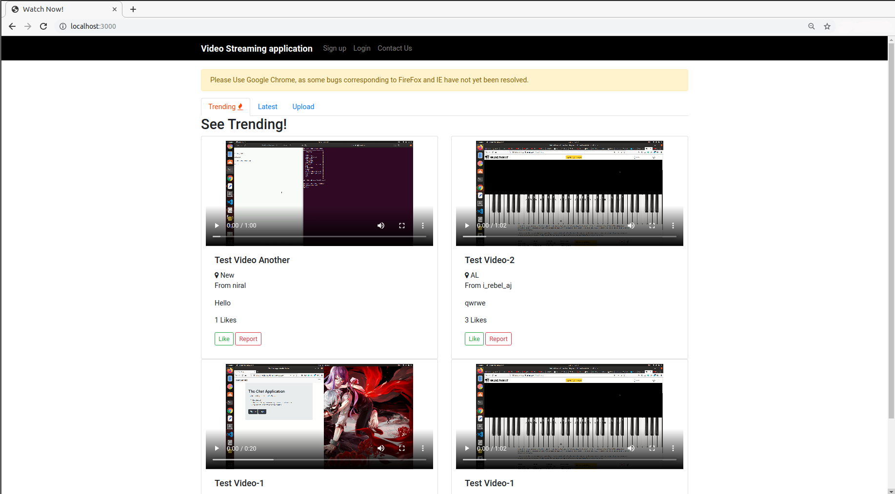
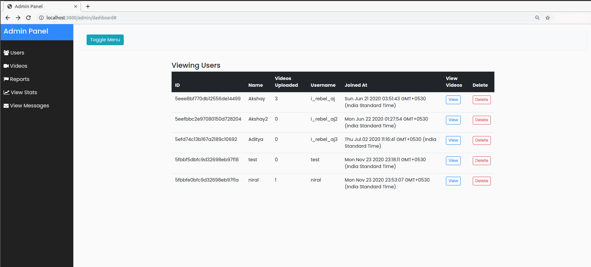
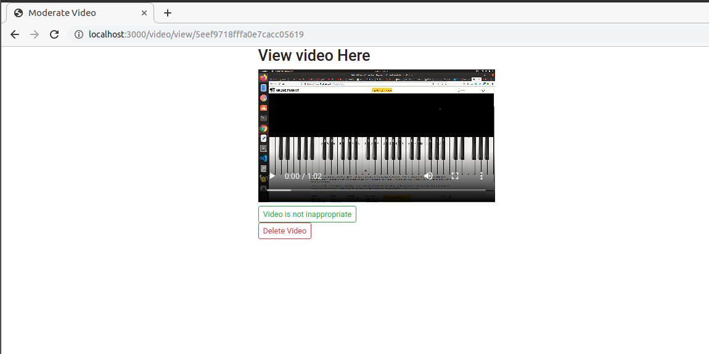

## **What is this application?**

This is a video streaming application like YouTube, where users can upload their videos for general users to see.

### **Dependencies Required**
1. Node.js
2. MongoDB

### **Installation and Running**
1. Clone the repository `git clone https://github.com/i-rebel-aj/Video-Streaming-App.git`
2. Make sure mongoDB instance is running `sudo service mongod start`
3. Install the relevant node.js dependencies `npm intall`
4. Start the server `npm start`

## **Client View**

* Clients need to be signed up before they can do anything.
* Signup as shown in the homepage, then login to proceed.
* You can upload videos, Like and Dislike by clicking on specific tabs.
* **Note video will be visible to you only if admin approves it, this is done to prevent inappropriate videos being uploaded**
    * For admin approval go to `localhost:XXXX/admin/dashboard`

### **Home page in latest version looks like this**
 

## **Admin View**

* Browse to /admin/dashboard i.e `localhost:XXXX/admin/dashboard`
* You can moderate the videos uploaded, in the **videos** section of the nav. 

### **This is how Admin Panel Looks** 
 
 
* Click on Video then View, here you can moderate the content.

### **Video Moderation Page**

**Use Cases**

Following application contains two types of users:-

1. Admin
2. Clients

_Role of Admins_
* To Add/Delete Moderators
* To Ban Clients
* To Add/Delete Videos
* To Moderate Content

_Role of Clients_
* Upload Video
* Delete Their Own Uploaded Video
* Like/Unlike Videos
* Report a video for moderators to verify
* Sort Videos based on the "Trending Video algorithm" ((Views+Likes)/Per_unit_time)
